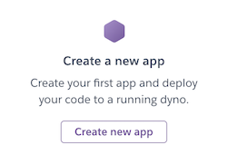
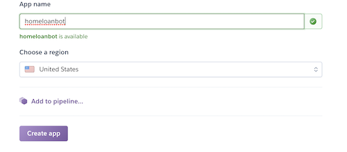
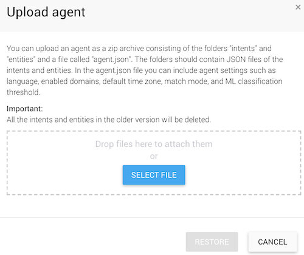
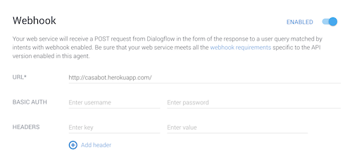
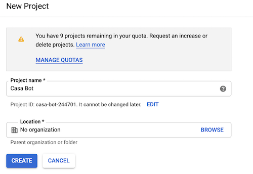
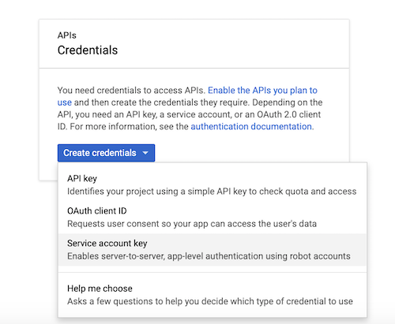
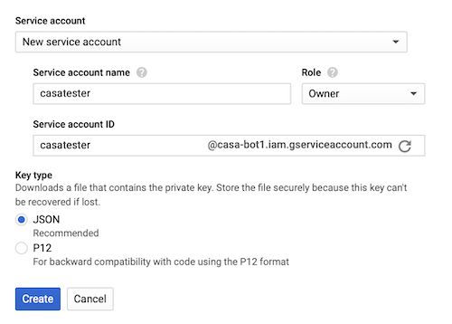
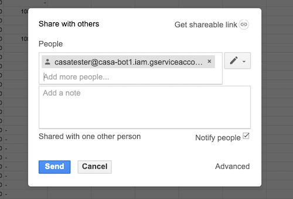
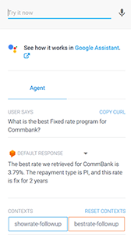
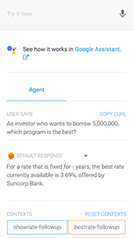

# Home Loan Chatbot (Casabot) with Dialogflow

41004: Analytics Capstone Project Deliverable, Autumn 2019.

Subject Coordinator: [Dr. Wei Liu](https://www.uts.edu.au/staff/wei.liu)

Supervisor: [Dr. Wei Liu](https://www.uts.edu.au/staff/wei.liu)

## Table of Contents

1. [About](#markdown-header-about)
2. [Demo](#markdown-header-demo)
3. [Prerequisities](#markdown-header-prerequisites)
4. [Installation](#markdown-header-installation)
5. [Sample Questions](#markdown-header-sample-questions)
6. [Testing](#markdown-header-testing)
7. [Further Development](#markdown-header-further-development)
8. [Final Words](#markdown-header-final-words)

## About

Casabot is founded in 2019 by David, Jonathan and Limyandi. Our mission is to make a great artificial intelligence product to ease people to get accurate, quick, and reliable information on home loan rate.
In this project, a development version of the chatbot is released and can be tested in Dialogflow and Facebook messenger, to help user to get accurate and reliable home loan rate offered by top Australian Banks.

## Demo

To see the working demo, click on the following links

- [Dialogflow Instant Chat](https://bot.dialogflow.com/CasaBot)
- [Facebook Messenger](https://www.messenger.com/t/400454180513269)

## Prerequisites

To run the chatbot in you will need to have the following

- [Free Dialogflow account](https://console.dialogflow.com)
- [Google Drive Account](https://drive.google.com/drive/u/0/) - Google Sheet Setup.

## Installation

### Step 1. Set up your own Domain Name Server

#### a. Set up your server to handle webhook call to be used for fulfilment in dialogflow or use our sample webhook server link to start (<http://casabot.herokuapp.com>)

#### b. If you decide to set up your own server. You can clone our heroku server. First, create a [heroku](<https://dashboard.heroku.com/login>) account

#### c. Create new app and name it anything you like

 

#### d. Using terminal, add the heroku remote repository (if it prompts you to login, login with your credentials)

    $ heroku git:remote -a homeloanbot

#### e. Deploy the cloned application

    $ git add .
    $ git commit -am "cloned casabot server"
    $ git push heroku master

### Step 2. Dialogflow

#### a. Create your free [Dialogflow](<https://dialogflow.com/docs/getting-started/create-account>) account

#### b. Create the agent

#### c. Go to 'Settings' beside Agents list on top left below Dialogflow icon. Then, access the 'Export and Import' tab. Finally, click the 'Restore From Zip' button

#### d. Drop the cloned Casabot.zip files and then click the 'Restore' button

#### e. Move to 'Fulfillment' tab on the center of the left navigation bar (the one with thunder-like icon). Enable the Webhook and then fill in the URL to handle the webhook requests (you can also use our default one, but you would need to use your own URL to modify the bot behaviour)

#### f. Go to 'Integrations' tab below 'Fulfillment' and choose any platform that you would like to integrate with

### Step 3. GoogleSheets Setup

#### a. Go to [Google API Console](<https://console.developers.google.com>) and sign in

#### b. Create a project (You can name it anything)

#### c. Enable Google Sheets and Google Drive APIs

#### d. Create Credentials and select Service Account Key

#### e. Enter Service account details

The service account key is preferable to be a JSON file. Onced you create the key, a JSON file will be automatically downloaded to your computer. Copy that file into your project directory.

#### f. Open the JSON file and copy the client email to the spreadsheet

#### g. Copy the sample database (for demo purpose get the 'static.xlsx') to Google Drive and share the file to the client email

#### h. Set up in Python

    import gspread
    from oauth2client.service_account import ServiceAccountCredentials

    scope = ['https://spreadsheets.google.com/feeds',
    'https://www.googleapis.com/auth/drive']
    creds = ServiceAccountCredentials.from_json_keyfile_name('Casa Bot1-ef1391ca5341.JSON', scope)
    client = gspread.authorize(creds)

    #Example to view the spreadsheet:
    spreadsheet = client.open('Static').sheet1
    print(spreadsheet.get_all_records())

For Further reference, go to a great tutorial created by [Erik](<https://erikrood.com/Posts/py_gsheets.html>) to help you getting started with setting up your GoogleSheet API.

## Sample Questions

 1. What is the best rate for Commbank at the moment?
 2. Please compare this bank to NAB
 3. Can you tell me the best P&I Fixed rate home loan at the market?
 4. What is P&I repayment type?
 5. How does IO repayment type works?
 6. If I want 5 year variable rate, which bank has the best offer?
 7. As an investor who needs 5,000,000 AUD, which program is the best?

## Testing

 

## Further Development

 1. Utilise proper RDBMS for storing the larger database (i.e. [MYSQL](<https://dev.mysql.com/downloads/mysql/>))
 2. Change the data collection method using API once the Home loan API is developed

## Final Words

All the best trying out. If you have any problem or feedback regarding setting up or usage of the product, please feel free to contact us via utsbankchatbot@gmail.com
